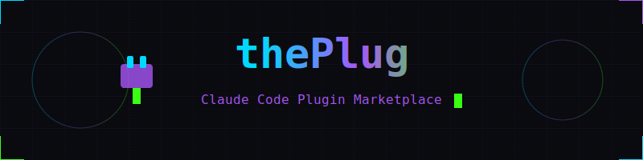

<!-- ANIMATED HEADER -->
<div align="center">



<!-- PIXEL WALKER - Watch him walk across your README! -->


<!-- TYPING ANIMATION -->
<a href="https://git.io/typing-svg"></a>

<!-- NEON BADGES -->
<p>


</p>

<!-- ANIMATED DIVIDER -->


</div>

```
                    ╔══════════════════════════════════════════════════════════════╗
                    ║  ████████╗██╗  ██╗███████╗██████╗ ██╗     ██╗   ██╗ ██████╗  ║
                    ║  ╚══██╔══╝██║  ██║██╔════╝██╔══██╗██║     ██║   ██║██╔════╝  ║
                    ║     ██║   ███████║█████╗  ██████╔╝██║     ██║   ██║██║  ███╗ ║
                    ║     ██║   ██╔══██║██╔══╝  ██╔═══╝ ██║     ██║   ██║██║   ██║ ║
                    ║     ██║   ██║  ██║███████╗██║     ███████╗╚██████╔╝╚██████╔╝ ║
                    ║     ╚═╝   ╚═╝  ╚═╝╚══════╝╚═╝     ╚══════╝ ╚═════╝  ╚═════╝  ║
                    ║                                                              ║
                    ║         ███╗   ███╗ █████╗ ██████╗ ██╗  ██╗███████╗████████╗ ║
                    ║         ████╗ ████║██╔══██╗██╔══██╗██║ ██╔╝██╔════╝╚══██╔══╝ ║
                    ║         ██╔████╔██║███████║██████╔╝█████╔╝ █████╗     ██║    ║
                    ║         ██║╚██╔╝██║██╔══██║██╔══██╗██╔═██╗ ██╔══╝     ██║    ║
                    ║         ██║ ╚═╝ ██║██║  ██║██║  ██║██║  ██╗███████╗   ██║    ║
                    ║         ╚═╝     ╚═╝╚═╝  ╚═╝╚═╝  ╚═╝╚═╝  ╚═╝╚══════╝   ╚═╝    ║
                    ╚══════════════════════════════════════════════════════════════╝
```

<div align="center">

### `[ CURATED CLAUDE CODE PLUGIN COLLECTION ]`

*Power up your AI development workflow with handpicked plugins.*

</div>

---

## `> SYSTEM.INIT`

<table>
<tr>
<td width="60%">

**thePlug** is a curated **marketplace** of Claude Code plugins — carefully selected tools that enhance AI-assisted development with powerful new capabilities.

```diff
+ Curated plugins      → Quality assured
+ Easy installation    → One command setup
+ Active maintenance   → Regular updates
+ Community driven     → Open contributions
```

</td>
<td width="40%">

```
    ┌─────────────────┐
    │  ░░░░░░░░░░░░░  │
    │  ░  PLUGINS  ░  │
    │  ░░░░░░░░░░░░░  │
    │    ◢████◣       │
    │   ◢██████◣      │
    │  ███▓▓▓▓███     │
    │  ██◤    ◥██     │
    │   ▀▀    ▀▀      │
    └─────────────────┘
         ║    ║
    [PLUG_BOT v1.0]
```

</td>
</tr>
</table>

---

## `> WORKFLOW.VISUALIZE`

```
╭──────────────────────────────────────────────────────────────────────────────╮
│                                                                              │
│    ┏━━━━━━━━━━━━━┓      ┏━━━━━━━━━━━━━┓      ┏━━━━━━━━━━━━━┓                 │
│    ┃  🔍 BROWSE  ┃ ───▶ ┃  📦 INSTALL ┃ ───▶ ┃  ⚡ ENHANCE ┃                 │
│    ┗━━━━━━━━━━━━━┛      ┗━━━━━━━━━━━━━┛      ┗━━━━━━━━━━━━━┛                 │
│          │                    │                    │                         │
│          ▼                    ▼                    ▼                         │
│    ╔═══════════╗        ╔═══════════╗        ╔═══════════╗                   │
│    ║  Explore  ║        ║   Clone   ║        ║   Power   ║                   │
│    ║  Catalog  ║        ║  & Setup  ║        ║    Up!    ║                   │
│    ╚═══════════╝        ╚═══════════╝        ╚═══════════╝                   │
│                                                                              │
╰──────────────────────────────────────────────────────────────────────────────╯
```

---

## `> INSTALL.EXECUTE`

<details>
<summary><b>⚡ Quick Install (Recommended)</b></summary>

```bash
# Install any plugin directly
claude plugins install /path/to/ClaudePlugins/<plugin-name>
```

</details>

<details>
<summary><b>🔧 Clone Entire Marketplace</b></summary>

```bash
# Clone the marketplace
git clone https://github.com/danielostrow/theplug-marketplace.git
cd theplug-marketplace

# Install desired plugin
claude plugins install ./<plugin-name>
```

</details>

---

## `> PLUGINS.CATALOG`

```python
┌────────────────────────────────────┬─────────┬─────────────────────────────────────────────┐
│ PLUGIN                             │ VERSION │ DESCRIPTION                                 │
├────────────────────────────────────┼─────────┼─────────────────────────────────────────────┤
│ 📸 scrape-studio                   │ 1.0.0   │ Visual AI-powered web scraper with dynamic  │
│                                    │         │ Puppeteer scripts, captcha handling,        │
│                                    │         │ scheduling, and ETL pipelines               │
└────────────────────────────────────┴─────────┴─────────────────────────────────────────────┘
```

<!-- PLUGINS-START -->
<!-- Auto-generated plugin list goes here -->
<!-- PLUGINS-END -->

---

## `> CATEGORIES.INDEX`

<table>
<tr>
<td align="center">

**🔍 DATA EXTRACTION**
```
Scraping • Parsing
ETL Pipelines
```

</td>
<td align="center">

**🤖 AI TOOLS**
```
Coming Soon
```

</td>
<td align="center">

**🛠️ DEV UTILS**
```
Coming Soon
```

</td>
</tr>
</table>

---

## `> CONTRIBUTE.GUIDE`

<table>
<tr>
<td>

### `🚀 Add Your Plugin`
1. Fork this repository
2. Add your plugin directory with valid `.claude-plugin/plugin.json`
3. Run `./scripts/update-readme.sh`
4. Submit a pull request

### `📋 Requirements`
```diff
+ .claude-plugin/plugin.json manifest
+ README.md with documentation
+ Follow Claude Code best practices
```

</td>
<td>

```
    ┌─────────────────┐
    │   CONTRIBUTE    │
    │   ───────────   │
    │                 │
    │   Fork  →  Add  │
    │     ↓      ↓    │
    │   Test → Submit │
    │                 │
    │  [OPEN SOURCE]  │
    └─────────────────┘
```

</td>
</tr>
</table>

---

## `> SCRIPTS.UTIL`

```bash
# Regenerate the plugin table
./scripts/update-readme.sh
```

---

<div align="center">


## `> AUTHOR.INFO`

```
╭────────────────────────────────────────────╮
│                                            │
│           ██████╗  ██████╗                 │
│           ██╔══██╗██╔═══██╗                │
│           ██║  ██║██║   ██║                │
│           ██║  ██║██║   ██║                │
│           ██████╔╝╚██████╔╝                │
│           ╚═════╝  ╚═════╝                 │
│                                            │
│         DANIEL OSTROW                      │
│   Software Engineer & Quantum Researcher   │
│                                            │
╰────────────────────────────────────────────╯
```

<a href="https://neuralintellect.com">

</a>
<a href="https://github.com/danielostrow">

</a>

---

### `[ MIT LICENSE ]`

*Each plugin maintains its own license. See individual directories for details.*


</div>

<!--
    ████████╗██╗  ██╗███████╗██████╗ ██╗     ██╗   ██╗ ██████╗
    ╚══██╔══╝██║  ██║██╔════╝██╔══██╗██║     ██║   ██║██╔════╝
       ██║   ███████║█████╗  ██████╔╝██║     ██║   ██║██║  ███╗
       ██║   ██╔══██║██╔══╝  ██╔═══╝ ██║     ██║   ██║██║   ██║
       ██║   ██║  ██║███████╗██║     ███████╗╚██████╔╝╚██████╔╝
       ╚═╝   ╚═╝  ╚═╝╚══════╝╚═╝     ╚══════╝ ╚═════╝  ╚═════╝

    Thanks for checking out thePlug! Power up your Claude Code.
-->
